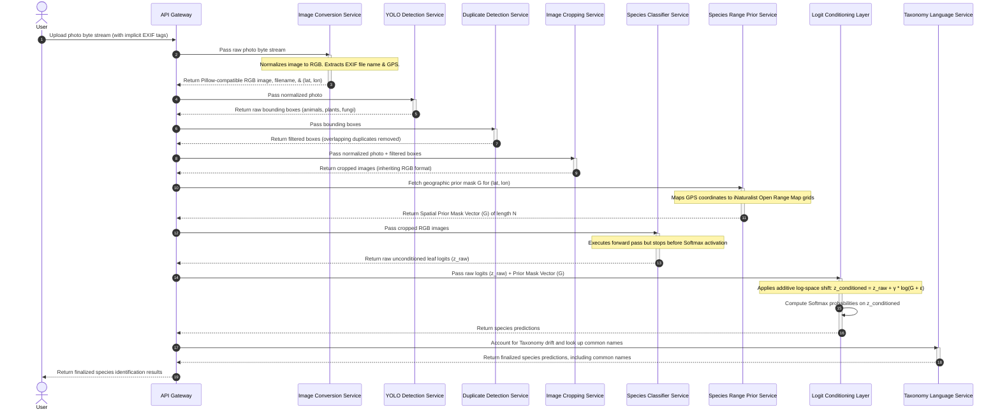

# System Architecture

The following sequence diagram illustrates the internal processing pipeline for analyzing an uploaded photograph. It tracks the chronological flow of data through metadata extraction, detection, deduplication, cropping, model inference, and logit conditioning.

## Components

1. [API Gateway](./api-gateway.md)
2. [Image Conversion Service](./image-conversion-service.md)
3. [YOLO Detection Service](./yolo-detection-service.md)
4. [DeDuplicate Detection Service](./deduplicate-detection-service.md)
5. [Image Cropping Service](./image-cropping-service.md)
6. [Species Classifier Service](./species-classifier-service.md)
7. [Species Range Prior Service](./species-range-prior-service.md)
8. [Logit Conditioning Layer](./logit-conditioning-layer.md)