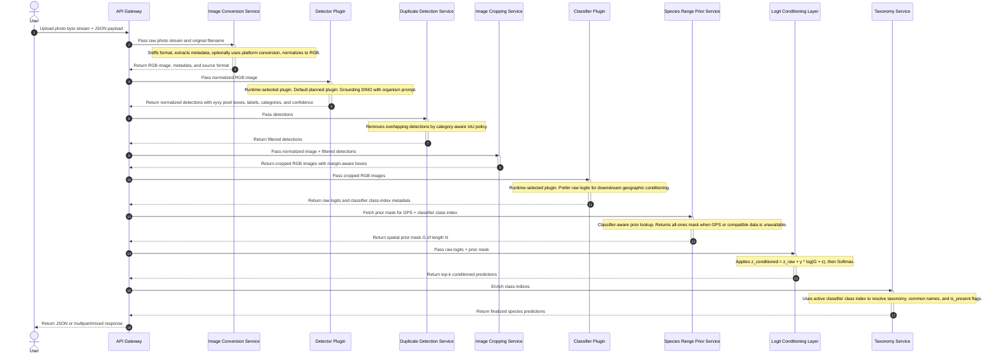

# System Architecture

Wild Catalog is organized as a small API gateway around a model-agnostic identification pipeline. The detector and classifier are runtime-selected plugins so the project can adopt better models over time without rewriting the API, image conversion, cropping, geographic conditioning, or taxonomy layers.

[Implementation Plan](./implementation-plan.md)

## Pipeline overview

## Key architectural rules

1. The API gateway owns HTTP only.
2. The pipeline owns orchestration only.
3. Detector plugins own model-specific detection preprocessing, inference, and postprocessing.
4. Classifier plugins own model-specific crop preprocessing, inference, and class-index metadata; the pipeline depends on `SpeciesClassifier`, not concrete plugins such as Birder.
5. The range prior service must be aware of the active classifier class index.
6. The logit conditioning layer should operate on tensors and prior vectors only.
7. Taxonomy enrichment should use classifier class-index metadata rather than assuming one hard-coded taxonomy forever.
8. Platform image conversion is isolated inside the image conversion service.

## Components

1. [API Gateway](./api-gateway.md)
2. [Image Conversion Service](./image-conversion-service.md)
3. [Detection Service](./detection-service.md)
4. [Duplicate Detection Service](./deduplicate-detection-service.md)
5. [Image Cropping Service](./image-cropping-service.md)
6. [Species Classifier Service](./species-classifier-service.md)
7. [Species Range Prior Service](./species-range-prior-service.md)
8. [Logit Conditioning Layer](./logit-conditioning-layer.md)
9. [Taxonomy Service](./taxonomy-service.md)
